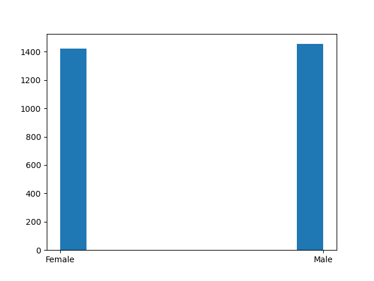

# Final Project
### Class: IA626 - Big Data Processing and Cloud Services 
### Term: Spring 2020 
### Prof. Conlon
***
 
## General Description:
***

For this project, I will looking at datasets derived from the National Health and Nutrition Examination Survey (NHANES) public program, set forth by the Center of Disease Control (CDC). These datasets are dervied from https://wwwn.cdc.gov/nchs/nhanes/. The data is collected yearly from people across the United States for the purpose of better informing public health policy, among other uses. Specifically, I've decided to hone in on three particular datasets from the 2017-2018 NHANES data, namely datasets on Blood Pressure, Demographics, and Early Childhood. I chose to look at the datasets from those particular years because the combination of recent and interesting was deemed to best be sourced from those years. Using these datasets, I'll be processing the join of the three separate datasets using a Respondent Sequence Number, which is a person identifier number for the individual being examined contained within each of the three datasets. In addition, I'll be using the three datasets to draw interesting and useful analysis outputs, partly in the form of visualization.

## Coding Outlines: 
***

To tackle this coding problem, I've divided the coding efforts into broad sections as follows: 

1. **Data Exploration**  
> Pre-liminary exploration of data attributes such as size, type, distinct values, etc. 
2. **Creating Coded Dictionaries**
> The datasets from NHANES contain numerically coded datafields. In order to have the datafields be self-descriptive, a coded dictionary for each dataset is web-scraped from the corresponding .htm file of each dataset, and then used *section 4* to transform the dataset to a semantically descriptive version 
3. **Loading Data**
> Loading the data from its orginal source to a pandas dataframe, to be able to begin doing work on it 
4. **Transforming Data**
> Transforming and cleaning the dataset as need be, and altering the dataset from a numerical coded version to a semantically descriptive version, through the use of the created coded dictionary in *section 2*
5. **Merging Data**
> Merging the three datasets into one combined dataset, joining appropriately using their shared Respondent Sequence Numbers (aka person identifier)
6. **Data Analysis** 
> Performing various data analysis scripts to find out interesting results from the collected data

### 1. Data Exploration 
***

The three datasets of interest were downloaded as .xpt files from the NHANES website. We want to better understand the attributes of the datasets. Therefore, we first want to explore the datasets and see what they look like. 

The code looks like this for the Early Childhood data (and will be repeated for the other two datasets exactly):
```python
with open('datasets/EarlyChildhood_2017-2018_NHANES.XPT', 'rb') as f:
    for row in xport.Reader(f):
        if n == 0:
            print("Sample EC data row: ", row)
            print("type of each EC row:", type(row))
            print("Number of EC columns:", len(row))
``` 

With the results, we see the following from the 3 datasets: 
```
Sample EC data row:  (93703.0, 35.0, 2.0, 8.0, 11.0, nan, nan, 3.0, 2.0, nan)
type of each EC row: <class 'tuple'>
Number of EC columns: 10
Number of EC rows: 3093


Sample BP data row:  (93703.0, nan, 120.0, nan, nan, nan, 1.0, nan, nan, nan, nan, nan, nan, nan, nan, nan, nan, nan, nan, nan, nan)
type of each BP row: <class 'tuple'>
Number of BP columns: 21
Number of BP rows: 8704


Sample D data row:  (93703.0, 10.0, 2.0, 2.0, 2.0, nan, 5.0, 6.0, 2.0, 27.0, nan, nan, 1.0, 1.0, nan, nan, nan, nan, nan, 1.0, 1.0, 2.0, 1.0, 2.0, 2.0, nan, nan, nan, nan, 5.0, 5.0, 3.0, 0.0, 0.0, 1.0, 2.0, 3.0, 1.0, 3.0, 9246.491864820517, 8539.7313482887, 2.0, 145.0, 15.0, 15.0, 5.0)
type of each D row: <class 'tuple'>
Number of D columns: 46
Number of D rows: 9254
```

Now we have an idea of what the dataset looks like, seeing a sample row of the datasets, understanding the datatype (i.e. tuple), and size of each dataset. This will inform us in how to proceed down the line. We can see that the size of the datasets is relatively small, looking at the rows and columns of each dataset. This fact will allow us to load the data into memory down stream, without much slowing down of our code. 

### 2. Created Coded Dictionary 
***

*note: the codes and results shown in this section is specifically for the Early Childhood dataset only, to reduce redundancy. Since the other datasets are identical in datatype and format, the codes will all be virtually identical for each dataset, except for minor corresponding alterations*


Before loading the data and beginning data cleaning and data transformation, I decided to web-scrape the coded definition descriptions for each dataset. On the NHANES website, each dataset and its .xpt datafile is accompanied by a 'read-me' .htm file. Within this .htm file is where teh coded definition descriptions are described, contained in individual tables per each data column. We need to write a parsing code for this .htm file, to be able to extract the coded definitions into python dictionaries, that will be then used in the data transformation process in *step 4*. 


the general parsing loop used for each dataset looks like this: 


```python
lines = file.split('\n')
parse = False           

tn = 0 
tr = 0 
td = 0

EC_codes = []  
table_codes = {} 
i = 0
# for loop to create coded dictionary 
for item in lines: 
    if "Codebook and Frequencies" in item: 
        parse = True
    if parse == True and '<table class="values">' in item: 
        if table_codes != {}:
            EC_codes.append(table_codes)            
        table_codes = {} 
        tn += 1 
        tr = 0 
        td = 0
    if parse == True and '<tr>' in item: 
        tr += 1
    if parse == True and '<td' in item: 
        td += 1
    # locating the row with the value of interest
    if '<td scope="row" class="values"' in item: 
        key = re.split('<|>', item)[2]
        value = re.split('<|>', lines[i+1])[2]
        table_codes[key] = value      
        
    i += 1 
# appending the last table of codes collected from the above loop    
EC_codes.append(table_codes)

```


Printing the coded dictionary thus far...

```python

for item in EC_codes:
        print(item)

```

...we get the following: 

*note: each printed line reprentes the coded description dictionary for ONE data column of the dataset, in this case the Early Childhood dataset*

```
{'15 to 44': 'Range of Values', '14': '14 years or younger', '45': '45 years or older', '7777': 'Refused', '9999': "Don't know", '.': 'Missing'}
{'1': 'Yes', '2': 'No', '7': 'Refused', '9': "Don't know", '.': 'Missing'}
{'4 to 10': 'Range of Values', '3': '3 pounds or less', '11': '11 pounds or more', '7777': 'Refused', '9999': "Don't know", '.': 'Missing'}
{'0 to 15': 'Range of Values', '7777': 'Refused', '9999': "Don't know", '.': 'Missing'}
{'1': 'More than 5-1/2 lbs. (2500 g), or', '2': 'Less than 5-1/2 lbs. (2500 g)?', '7': 'Refused', '9': "Don't know", '.': 'Missing'}
{'1': 'More than 9 lbs. (4100 g), or', '2': 'Less than 9 lbs. (4100 g)?', '7': 'Refused', '9': "Don't know", '.': 'Missing'}
{'1': 'Overweight', '2': 'Underweight', '3': 'About the right weight', '7': 'Refused', '9': "Don't know", '.': 'Missing'}
{'1': 'Yes', '2': 'No', '7': 'Refused', '9': "Don't know", '.': 'Missing'}
{'1': 'Yes', '2': 'No', '7': 'Refused', '9': "Don't know", '.': 'Missing'}

```
Looking at the results, you can notice that some of the columns keys are ranges rather than exact values (e.g. line 1, first dictionary key). We need to transform these particular keys into a range of values, so we can easily transform the data downstream. Therefore, we process those cases in the following way: 

```python
for dic in EC_codes:
    for key in dic.keys(): 
        if 'to' in key:
            # spliting string where there is a numerical range involved
            a = key.split('to')
            # removing leading and trailing white spaces from the list values 
            a = [x.strip(' ') for x in a]
            # replace the range values in the string with a 'range' datatype variable
            num_range = range(int(a[0]), int(a[1]) + 1)
            dic[num_range] = dic[key]
            del dic[key]

for item in EC_codes:
        print(item)

```

Looking now at the resulting coded dictionary, we see the keys with the ranges have been usefully altered to 'range' datatypes:

*note: the order of the dictionary keys has changed since we removed the old range key and replaced it with a new one. Given dictionaries are unordered datatypes, this does not make any difference for us down the line*

```
{'14': '14 years or younger', '45': '45 years or older', '7777': 'Refused', '9999': "Don't know", '.': 'Missing', range(15, 45): 'Range of Values'}
{'1': 'Yes', '2': 'No', '7': 'Refused', '9': "Don't know", '.': 'Missing'}
{'3': '3 pounds or less', '11': '11 pounds or more', '7777': 'Refused', '9999': "Don't know", '.': 'Missing', range(4, 11): 'Range of Values'}
{'7777': 'Refused', '9999': "Don't know", '.': 'Missing', range(0, 16): 'Range of Values'}
{'1': 'More than 5-1/2 lbs. (2500 g), or', '2': 'Less than 5-1/2 lbs. (2500 g)?', '7': 'Refused', '9': "Don't know", '.': 'Missing'}
{'1': 'More than 9 lbs. (4100 g), or', '2': 'Less than 9 lbs. (4100 g)?', '7': 'Refused', '9': "Don't know", '.': 'Missing'}
{'1': 'Overweight', '2': 'Underweight', '3': 'About the right weight', '7': 'Refused', '9': "Don't know", '.': 'Missing'}
{'1': 'Yes', '2': 'No', '7': 'Refused', '9': "Don't know", '.': 'Missing'}
{'1': 'Yes', '2': 'No', '7': 'Refused', '9': "Don't know", '.': 'Missing'}

```

A similar nearly identical code is written for the Blood Pressure and Demographics datasets as well, to produce a similar coded dictionary. We are now ready to load the data in! 

### 3. Loading Data
***
*note: the codes and results shown in this section is specifically for the Early Childhood dataset only, to reduce redundancy. Since the other datasets are identical in datatype and format, the codes will all be virtually identical for each dataset, except for minor corresponding alterations* 

Next, we want to load the datasets into python memory. Since each dataset is relatively managable in size, we can directly load the datasets into their individual pandas dataframe without much memory usage. 


The code to load the dataset:

```python

# Load Early-Childhood data into dataframe

i = 0
mylist = []

with open('datasets/EarlyChildhood_2017-2018_NHANES.XPT', 'rb') as f:
    for row in xport.Reader(f):
        a = list(row)
        # remove unwanted data fields for the row 
        a.pop()
        a.pop()
        a.pop()
        mylist.append(a)
        i += 1

df_ec = pd.DataFrame(mylist, columns = ["RESP#", "Mother's Age When Born", "Mother Smoked When Pregnant", \
"Weight At Birth Lbs", "Weight At Birth Ozs", "Weight More/Less than 5.5lbs", "Weight More/Less than 9.0lbs"])
##print(df_ec)

# replacing all NaN fields with '.', which will help the conversion of the numerical code values 
# downstream 
df_ec = df_ec.fillna("123456789")

```

As can be seen in the code above, using the .pop() method, we removed some of the columns in the original datafile during the loading process for the Early Childhood dataset. This was based on personal preference, dictated by what fields seemed like interesting and/or relevant fields to ultimately perform analysis on in *section 6*. The same was done for the Blood Pressure and Demographic datasets. 

printing the loaded dataframe, we get: 

```
RESP# Mother's Age When Born Mother Smoked When Pregnant Weight At Birth Lbs Weight At Birth Ozs Weight More/Less than 5.5lbs Weight More/Less than 9.0lbs
0      93703.0                     35                           2                   8                  11                    123456789                    123456789
1      93704.0                     29                           2                   7                   9                    123456789                    123456789
2      93707.0                     34                           2                   7                   2                    123456789                    123456789
3      93710.0                     28                           2                   7                  12                    123456789                    123456789
4      93719.0                     25                           2                   5                   8                    123456789                    123456789
...        ...                    ...                         ...                 ...                 ...                          ...                          ...
3088  102941.0                     19                           2                   6                   0                    123456789                    123456789
3089  102942.0                     24                           2                   7                   4                    123456789                    123456789
3090  102945.0                     25                           2                   7                   3                    123456789                    123456789
3091  102951.0                     29                           1                   7                   9                    123456789                    123456789
3092  102955.0                     36                           2                   8                   1                    123456789                    123456789
```

Now that the data is loaded, we can begin to further clean and transform the data accordingly. On to the next step...

### 4. Transforming Data 
***
*note: the codes and results shown in this section is specifically for the Early Childhood dataset only, to reduce redundancy. Since the other datasets are identical in datatype and format, the codes will all be virtually identical for each dataset, except for minor corresponding alterations*

Next, we want to take the loaded up datasets, and the corresponding coded dictionaries, and transform the datasets. The transformation process will largely center around converting the original numerical coded style dataset into a semantically descriptive dataset, where the values are self-descriptive rather than coded. 

Before starting make the dataset semantically descriptive, first we need to address datatype issues. Specifically, the individual dataset fields are originally 'str' types. To keep the consistency with the decimal points of some of the columns, the below code will convert the datatypes from 'str' to 'int32', and then back to 'str'. This effectively makes all the numerical values in intergers forms with no numbers after the decimal point, yet they remain a 'str' datatype: 

*note: For the Demographics dataset, there is a single column that requires precision up to 2 digits past the decimal point. To deal with this sole case, the code for the Demographics dataset was slightly altered to capture this case, but otherwise is identical to the code below for the Early Childhood dataset.*

```python

# change all values to 'int32' to remove decimal points off the numeric values
df_ec = df_ec.astype({"RESP#":'int32', "Mother's Age When Born":'int32', "Mother Smoked When Pregnant":'int32', \
"Weight At Birth Lbs":'int32', "Weight At Birth Ozs":'int32', "Weight More/Less than 5.5lbs":'int32', \
"Weight More/Less than 9.0lbs":'int32' })

# change all values to 'str' so as to allow the replace() method to work seemlessly with the coded dictionary values 
df_ec = df_ec.astype({"RESP#":'str', "Mother's Age When Born":'str', "Mother Smoked When Pregnant":'str', \
"Weight At Birth Lbs":'str', "Weight At Birth Ozs":'str', "Weight More/Less than 5.5lbs":'str', \
"Weight More/Less than 9.0lbs":'str'})

# replace assigned 0 values with the appropriate '.' string which will aid in the coding transformation process
df_ec = df_ec.replace('123456789','.')

```

the resulting dataframe is now: 

*note how `RESP#` values are not integers with no digits past the decimal point, as opposed to its original format above*
```
       RESP# Mother's Age When Born  ... Weight More/Less than 5.5lbs Weight More/Less than 9.0lbs
0      93703                     35  ...                            .                            .
1      93704                     29  ...                            .                            .
2      93707                     34  ...                            .                            .
3      93710                     28  ...                            .                            .
4      93719                     25  ...                            .                            .
...      ...                    ...  ...                          ...                          ...
3088  102941                     19  ...                            .                            .
3089  102942                     24  ...                            .                            .
3090  102945                     25  ...                            .                            .
3091  102951                     29  ...                            .                            .
3092  102955                     36  ...                            .                            .

[3093 rows x 7 columns]

```

Now the dataset is ready to be transformed, as the datatype and digit precision is as we want it to be. Let's get started!

Prior to our main *transformation loop*, we first want to capture the names of the columns, which will be used to reference them during the loop. In the below code, we capture the column names in the list item `col_names`: 

```python
col_names  = []
for col in df_ec.columns:
    col_names.append(col)
``` 

Now, for the main *transformation loop*...

*note: within the second loop in this main `for` loop, there are `if` and `else` statements, that deal with the 1-to-1 dictionary conversion values and range conversion cases, respectively.*

```python
col_i = 0
for col in col_names:
    distinct_dic = {} 
    i = 0
    if col == 'RESP#':
        col_i += 1 
        continue
    
    for row_value in df_ec[col]:
        # for non-range key values in the coded dictionary
        if row_value in EC_codes[col_i-1].keys():
            df_ec[col_names[col_i]][i] = EC_codes[col_i-1][row_value]
            change_num += 1 
            if df_ec[col_names[col_i]][i] in distinct_dic.keys():
                distinct_dic[df_ec[col_names[col_i]][i]] += 1 
            else: 
                distinct_dic[df_ec[col_names[col_i]][i]] = 1    
            
        # for range key values in the coded dictionary 
        else: 
            if df_ec[col_names[col_i]][i] in distinct_dic.keys():
                distinct_dic[df_ec[col_names[col_i]][i]] += 1 
            else: 
                distinct_dic[df_ec[col_names[col_i]][i]] = 1 
            for key in EC_codes[col_i-1]:
                if type(key) == range:
                    if int(row_value) in key:
                        range_values += 1 
                    else: 
                        flag += 1 
                        flag_dic = {'row number':i, 'row value': row_value, 'range key': key}
                        flag_list.append(flag_dic)
        i += 1 
    distinct_values_list.append(distinct_dic)    
    col_i += 1 
```


There! Now the transformation process is complete for our individual dataframe dataset. Here is what the dataset now looks like: 

*note: The datafield values are all now self-descriptive!*

```
RESP# Mother's Age When Born Mother Smoked When Pregnant Weight At Birth Lbs Weight At Birth Ozs Weight More/Less than 5.5lbs Weight More/Less than 9.0lbs
0      93703                     35                          No                   8                  11                      Missing                      Missing
1      93704                     29                          No                   7                   9                      Missing                      Missing
2      93707                     34                          No                   7                   2                      Missing                      Missing
3      93710                     28                          No                   7                  12                      Missing                      Missing
4      93719                     25                          No                   5                   8                      Missing                      Missing
...      ...                    ...                         ...                 ...                 ...                          ...                          ...
3088  102941                     19                          No                   6                   0                      Missing                      Missing
3089  102942                     24                          No                   7                   4                      Missing                      Missing
3090  102945                     25                          No                   7                   3                      Missing                      Missing
3091  102951                     29                         Yes                   7                   9                      Missing                      Missing
3092  102955                     36                          No                   8                   1                      Missing                      Missing

[3093 rows x 7 columns]

```

After having done this for all 3 datasets, we now have 3 fully transformed datasets on our hands, ready to be merged into one big table. On to the next section....

### 5. Merging Data 
***

Now that we have the datasets transformed, cleaned up, and looking the way we want it to look, we can combine the three separate dataframes into one big giant dataframe. To do this, we do a sort of *join* process, in this case using the pandas method `pandas.merge()`. We use an *inner join* type of the `pandas.merge()` method, and we do the *inner join* on the `RESP#` fields which all datasets share in common, and which represents the person identifier number. Using *inner join* will capture all the cases where a person was surveyed for Early Childhood, Blood Pressure, AND Demographics. 

The code looks like follows: 

*note: the merge process is done in two steps, merging two datasets at a time* 

```python

ec_bp_merge = pd.merge(left=df_ec, right=df_bp, left_on='RESP#', right_on='RESP#', how = 'inner')

print(ec_bp_merge)

ec_bp_d_merge = pd.merge(left=ec_bp_merge, right=df_d, left_on='RESP#', right_on='RESP#', how = 'inner')

print(ec_bp_d_merge)
```


Our resulting final combined dataframe now looks like the following: 

```
RESP# Mother's Age When Born Mother Smoked When Pregnant Weight At Birth Lbs  ... Education Ages 6-19 Education Ages 20+ Marital Status        Ratio Of HH Income To Poverty
0      93703                     35                          No                   8  ...             Missing            Missing        Missing  Value greater than or equal to 5.00
1      93704                     29                          No                   7  ...             Missing            Missing        Missing  Value greater than or equal to 5.00
2      93707                     34                          No                   7  ...           6th grade            Missing        Missing                                    1
3      93710                     28                          No                   7  ...             Missing            Missing        Missing                                    4
4      93719                     25                          No                   5  ...           6th grade            Missing        Missing                                    3
...      ...                    ...                         ...                 ...  ...                 ...                ...            ...                                  ...
2871  102941                     19                          No                   6  ...           8th grade            Missing        Missing                                    1
2872  102942                     24                          No                   7  ...             Missing            Missing        Missing                                    2
2873  102945                     25                          No                   7  ...           9th grade            Missing        Missing                              Missing
2874  102951                     29                         Yes                   7  ...             Missing            Missing        Missing                                    1
2875  102955                     36                          No                   8  ...           8th grade            Missing        Missing                                    2

[2876 rows x 23 columns]

```
We can now see all the chosen columns for each of the 3 datasets all in one table, joined by their shared `RESP#`, fully transformed from numerically coded datafields to semantically descriptive datafields. The dataset is now ready to be fully explored and played around with! On to the data analysis...

### 6. Data Analysis  
***

Now that we have the data explored, loaded, cleaned up, and transformed, it is ready for analysis. I've done some preliminary analysis on the data, exploring the data through scatter plots and histograms. 




Due to time constraints, further and deeper analysis has yet to be done. 

